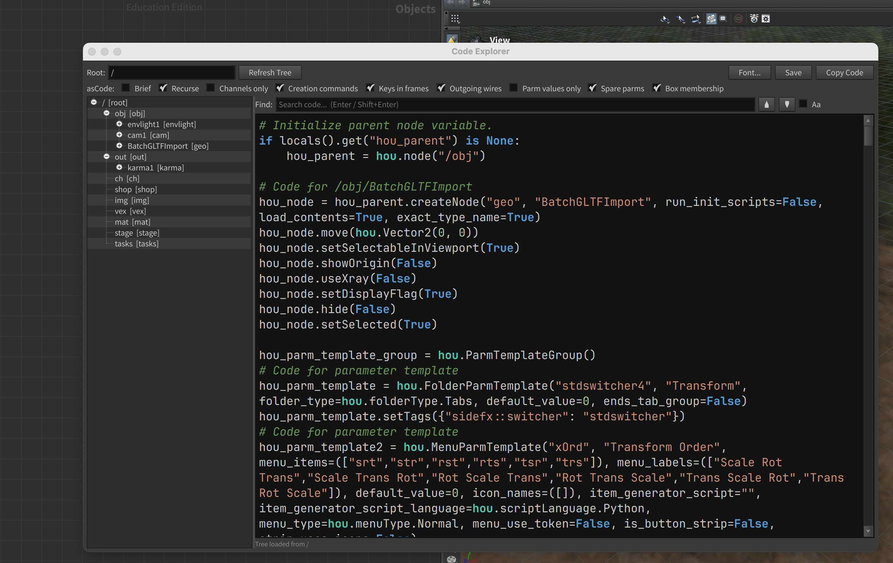

# Houdini Code Explorer

This is a houdini shelf tool to view the python code used to create houdini nodes. It is useful for understanding how nodes are created and when developing your own tools. 



## Installation

To install this tool first clone this repository into a folder of you choice. This will be the installation location for the tool and must not be deleted.

```bash
git clone https://github.com/NCCA/HoudiniCodeExplorer
```

The package is installed using the houdini hython interpretor so you need to ensure it is active before running the installation. Either open the houdini shell or change to the houdini directory and source the houdini setup script (for example in linux).

```bash
cd /opt/hfs21.0.559/
source setup_houdini_bash
```

Once the houdini environment is active you can install the package by running the following command from the HoudiniCodeExplorer directory:

```bash
./installHouPackage.py
```

This should report output similar to the following:

```
./installHouPackage.py 
{
  "load_package_once": "true",
  "env": [
    {
      "PYTHONPATH": "/home/jmacey/HoudiniCodeExplorer"
    }
  ]
}

 Shelf file created at: /home/jmacey/houdini21.0/toolbar/codeexplorer.shelf
  Contains 1 tools:
    - Code Explorer
```

## Houdini Shelf

You can now find the shelf by clicking on the shelf + icon in the toolbar and selecting "Code Explorer"


## History 

This started as a simple [blog post](https://jonmacey.blogspot.com/2011/01/houdini-python-ascode.html) and tool a long time ago. I have basically been using this for ages dumping data to a file and using snippets to build up my Houdini scripts.

I got a bit frustrated with this recently and decided to update it to have the code directly in houdini and give me the ability to show just what I needed. 

Still very much a work in progress but hopefully it will be useful, I also use this in my teaching to demonstrate how to write deploy tools to houdini so this a useful example of this. 

The basics started as a quick sketch of code which I then vibe coded with opencode, then re-factored into a more structured package and added more features.
